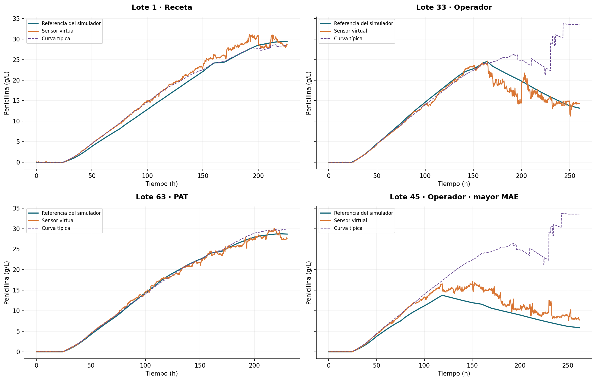
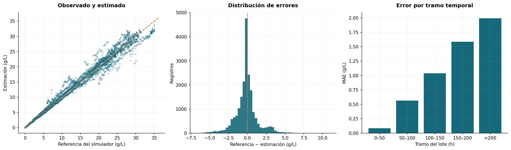

# Análisis predictivo aplicado a la producción de penicilina

Este proyecto utiliza señales operativas para estimar la **concentración actual de penicilina** en un proceso biofarmacéutico simulado. Evalúa lotes completos que el modelo no ha visto y compara sus resultados con una curva típica de concentración por tiempo y estrategia de control.

**Resultado principal:** XGBoost obtiene un MAE medio entre lotes de **0,95 g/L**, frente a **1,76 g/L** de la referencia, una reducción del **46,3 %** en 18 lotes normales reservados. La precisión disminuye al final de la fermentación y el modelo depende especialmente del tiempo transcurrido.

Los datos son **simulados por IndPenSim**, no mediciones reales de una planta. El proyecto no predice concentraciones futuras ni evalúa fallas. Los 10 lotes con fallas inyectadas quedan fuera del experimento.

## Notebook y resultados

- [Notebook completo, ejecutado y comentado](notebooks/Proyecto_5_Sensor_Virtual_Penicilina.ipynb).
- [Vista HTML del notebook](Proyecto_5_Sensor_Virtual_Penicilina.html): descargar y abrir en un navegador.
- [Métricas de prueba](exports_powerbi/metricas_prueba.csv).
- [Guía de tablas para Power BI](exports_powerbi/README.md).
- [Informe de ejecución](verification/execution.json).



## Datos y preparación

La fuente es el conjunto de **100 lotes de IndPenSim** de Stephen Goldrick, publicado en [Mendeley Data](https://data.mendeley.com/datasets/pdnjz7zz5x/2), DOI **10.17632/pdnjz7zz5x.2**, licencia **CC BY 4.0**.

El CSV contiene 113.935 registros, muestreados cada 12 minutos dentro de lotes de 167–290 horas. Se incluye un extracto comprimido de las primeras 37 posiciones del archivo: conserva todos los registros, ausentes y encabezados originales. El bloque Raman se excluye de este experimento.

La preparación documenta una discrepancia de encabezados y valida los identificadores por posición, tiempo y correspondencia con la tabla auxiliar. Las mediciones offline se conservan, pero no entran al modelo. Tampoco se utiliza el sustrato del simulador, las referencias de falla, el identificador de lote ni la concentración objetivo como entradas. Las estadísticas rotuladas en kilogramos no se interpretan como producción confirmada.

Consulte [la documentación de los datos](data/README.md) y [el diccionario completo](exports_powerbi/diccionario_variables.csv).

## Método

1. Auditoría estructural de los 100 lotes y exclusión de los 10 con fallas.
2. Separación estratificada por estrategia de control: **54 lotes de entrenamiento, 18 de validación y 18 de prueba**. No se mezclan filas de un lote entre particiones.
3. Análisis exploratorio limitado a entrenamiento y creación de **29 características** de proceso, tiempo, configuración e historial causal.
4. Comparación de curva típica, Ridge, Random Forest, HistGradientBoosting y XGBoost.
5. Selección con MAE medio entre lotes en validación y comprobación interna en tres particiones de lotes, sin cambiar la configuración seleccionada.
6. Reajuste con los 72 lotes de desarrollo y evaluación final en los 18 reservados.

El criterio principal da el mismo peso a cada lote. Las métricas globales por fila se presentan como complemento. El intervalo bootstrap remuestrea lotes completos, no observaciones individuales.

## Resultados de prueba

| Modelo | MAE medio entre lotes, g/L | MAE global, g/L | RMSE global, g/L | R² global |
|---|---:|---:|---:|---:|
| Curva típica por tiempo y estrategia | 1,764 | 1,853 | 4,186 | 0,821 |
| XGBoost, profundidad 6 | **0,948** | **0,963** | **1,484** | **0,978** |

El intervalo de remuestreo del 95 % para el MAE medio entre lotes es **[0,759; 1,156] g/L**. No es un intervalo de predicción individual. El modelo supera la referencia en los tres cortes internos de comprobación; sus MAE medios entre lotes son 2,058, 1,098 y 0,977 g/L, lo que evidencia sensibilidad a la composición de entrenamiento.

El error por tramo aumenta desde 0,083 g/L antes de 50 h hasta 1,994 g/L después de 200 h. La sensibilidad a la desalineación temporal muestra una fuerte dependencia del tiempo transcurrido, seguida por señales de gases. Estas asociaciones no prueban causalidad.



## Reproducción

Entorno verificado: Python 3.13.5. Desde la carpeta del proyecto:

```bash
python -m pip install -r requirements.txt
python -m ipykernel install --user --name python3 --display-name "Python 3"
python scripts/execute_notebook.py
python scripts/finalize_notebook.py
```

También puede abrirse el notebook en Jupyter o VS Code y ejecutar todas sus celdas. El extracto necesario está incluido; **no hace falta descargar los 2,57 GB originales ni instalar el simulador** para reproducir este análisis. Los tiempos de entrenamiento pueden variar según el equipo.

Las interpretaciones están escritas en celdas Markdown con los resultados verificados. Si se cambia el experimento, deben actualizarse. El generador de autoría permite reconstruirlas a partir de una ejecución nueva:

```bash
python scripts/build_notebooks.py
python scripts/execute_notebook.py
python scripts/finalize_notebook.py
```

`models/sensor_virtual.joblib` conserva el modelo final y el orden de características. Para aplicarlo a otros registros se debe reproducir la preparación del notebook y proporcionar el historial del lote; no admite sensores arbitrarios sin esa preparación.

## Límites

- El modelo aprende y se evalúa contra una referencia generada por el mismo simulador. No está validado para sustituir análisis de laboratorio ni para operar una planta real.
- La separación evalúa nuevos lotes de estrategias conocidas. No hay fechas para demostrar generalización cronológica entre campañas.
- Los lotes con fallas, Raman, predicción futura y optimización de recetas quedan fuera del alcance.
- La curva típica cambia de composición en tiempos tardíos cuando terminan algunos lotes; sus saltos no son cambios físicos de un reactor.
- Las unidades de determinadas señales se conservan en la escala original sin efectuar conversiones no verificadas.

## Referencias y atribución

- Goldrick, S. (2019). *Data for: Modern day monitoring and control challenges outlined on an industrial-scale benchmark fermentation process*. Mendeley Data, V2. [DOI](https://doi.org/10.17632/pdnjz7zz5x.2). Datos utilizados bajo **CC BY 4.0**; se ha extraído el bloque de proceso, corregido su nomenclatura en una copia y creado variables derivadas.
- Goldrick et al. (2015). *The development of an industrial-scale fed-batch fermentation simulation*. Journal of Biotechnology, 193, 70–82.
- Goldrick et al. (2019). *Modern day monitoring and control challenges outlined on an industrial-scale benchmark fermentation process*. Computers & Chemical Engineering, 130, 106471.
- [Notebook de referencia de Stephen Goldrick](https://github.com/StephenGoldie/indpensim-notebook).
